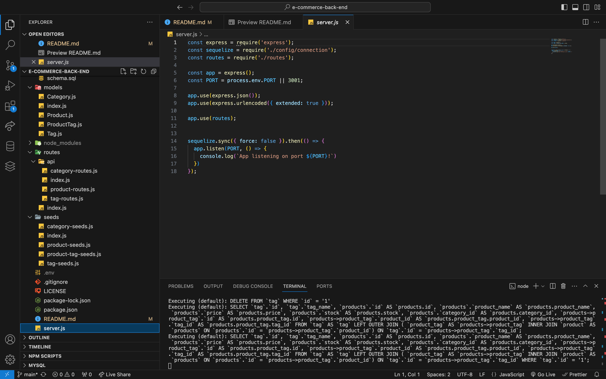

# e-commerce-back-end

## Description 
This backend e-commerce website provides the necessary tools to manage products, categories, and tags for an online store. It allows users to perform CRUD (Create, Read, Update, Delete) operations on products, categories, and tags.

## Table of Contents 
- [Installation](#Installation)
- [Usage](#Usage)
- [License](#License)
- [Contributing](#Contributing)
- [Tests](#Tests)
- [Questions](#Questions)

## Installation 
To install this project, please clone the repoository to your local machine and run 'npm install' to install the necessary dependencies. 

## Usage
To use this application, run npm run seed and then node server.js.

## License 
This project is licensed under the MIT License.

## Contributing 
N/A

## Tests
N/A

## Questions
GitHub Profile: [bwolson31](https://github.com/bwolson31)

For additional questions, contact me via email: bwolson31@gmail.com

